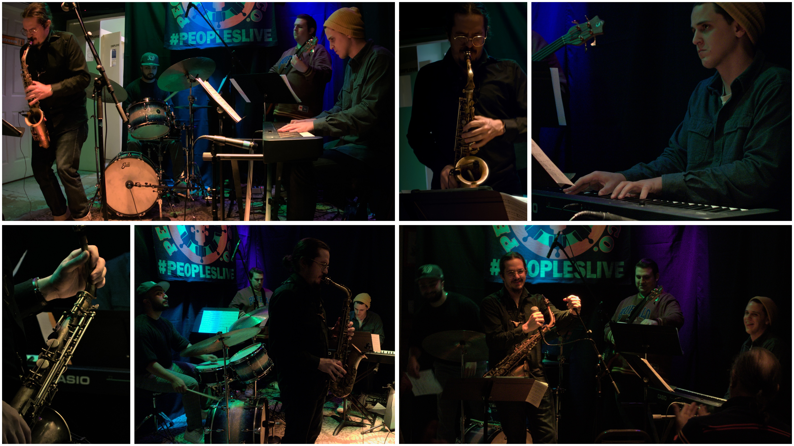

# Collage Maker - In-Browser, Local

I couldn't find a single free application that could create these simple collages, so I made one with basic HTML, CSS, and JS.

Everything runs offline (excluding some CDNs) and only these few libraries are being utilized:

- JQuery
- Bootstrap 3.4.1
- [Gridstack](https://github.com/gridstack/gridstack.js/)
- [dom-to-image](https://github.com/tsayen/dom-to-image)

## Usage

1. Open "editor.html" in Chrome & zoom out for best results

2. Under settings set desired Width & Height in pixels and click apply

3. Drag and drop photos from file manager onto white area to add to canvas

4. Do desired edits
    - Grab bottom right corner of photo to resize
    - Drag and drop photos to rearrange

5. Set padding in pixels and click apply

6. Click save

The collage will be downloaded as a JPEG after a brief delay depending on the size of the canvas.

## Examples
.jpeg>)

.jpeg>)

.jpeg>)

## Notes
It is possible to download as PNG or PDF as well, I believe. I'm not gonna bother because I only need JPEG at the moment, but if you need another format, it just takes modifying the dom-to-image integration in the print() JS function in editor.html.
